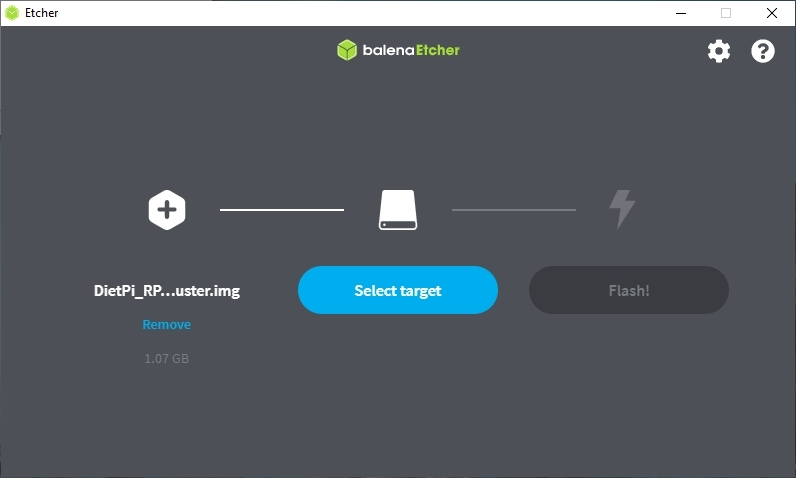
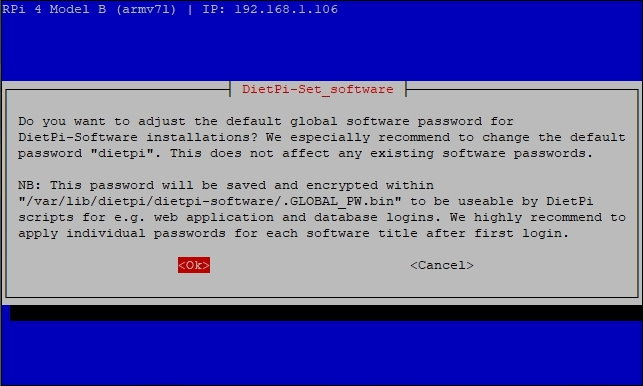

# How to install DietPi

## What do you need ?

To follow this tutorial, you will need the next hardware list:

 - A Raspberry Pi, Odroid or other SBC - open [the list of all supported SBC](/../Hardware-Supported_SBC/)
 - An SD card of at least 4G, and a way to read it on your computer (integrated slot or external SD card reader)
 - Optional: Ethernet (network) cable

For the software, just two are needed:

 - The latest DietPi image
 - _and_ the Etcher software to flash SD card. [Etcher](https://etcher.io/) is available for Windows, Linux and macOS. 

## Download and prepare the disk image
Open [dietpi.com](https://dietpi.com#download) and select “Download”. Various supported devices will be displayed. Download the disk image (about 1 GB in size).
For simplicity, the guide will follow the Raspberry Pi installation. 

_Specific steps to different platforms are detailed below._


### Unzip the disk image 

Unzip the dowloaded file to a local folder. 

It is a _7z_ archive format so you will need to install either [7zip for Windows](https://www.7-zip.org/) or [The Unarchiver (Macintosh)](http://wakaba.c3.cx/s/apps/unarchiver.html). Both are free of charge and have been tested to unzip the image correctly.

### Run Etcher and flash the image 

Once you have downloaded and installed [Etcher](https://etcher.io/), start the program. Also, make sure you have your SD card inserted into your computer.
Locate and select the DietPi image.


Next, ensure that the SD card selected is the correct one. It will wipe the drive clean, so if you choose the wrong one, you may risk losing data.



Once you have confirmed all the details are correct, proceed to flash the SD card. This process may take a while.


??? info "Click here if you want to pre-configure WiFi network " 
	To setup Wifi, open the SD card folder, and update next two files using a text editor of your choice:

	1.  Open the file named `dietpi.txt`. Find `AUTO_SETUP_NET_WIFI_ENABLED` and set to value 1.
	2.  Open the file `dietpi-wifi.txt` and set `aWIFI_SSID[0]` to the name of your WiFi network. 
    3.  In the same file `dietpi-wifi.txt`, set `aWIFI_KEY[0]` to the password of your WiFi network.
    4.  Save and close the files

Remove the SD card from the PC and insert it into the Raspberry Pi to prepare to boot for the first time. 

## First boot on DietPi

Insert the SD card into your Raspberry Pi and start it
A few seconds later, you can connect through SSH, or follow the instructions on the screen

### IP Scanning tool

For the following steps we require an IP Scanning tool to determine the IP address of the Raspberry Pi. 

For Windows, you could try `Advanced IP Scanner`. Download the tool from [here](https://download.advanced-ip-scanner.com).
For Linux, you can use nmap command:

```python
sudo apt-get install nmap #For installing Nmap
sudo nmap -sn 192.168.1.0/24 #For scanning IP address
```

### Connect to DietPi via SSH

A popular SSH Client for Windows is PUTTY. You can download putty from [here](https://www.chiark.greenend.org.uk/~sgtatham/putty/latest.html). 
Most Linux distributions come packaged with an ssh client. Simply type ssh in your terminal to access SSH Client.




## DietPi Launcher

DietPi Launcher will be automatically displayed on first login. It has lots of useful tools. 
One of the first options to try is to select `Software Optimised` and then tos install.


Option | Details
:----------- |:-------------
Help!         | This option will provide links to documents and useful information.
DietPi-Config | Enable configuration options: network, language/regional options etc.
Search | Find software to install
**Software Optimized** | Select DietPi optimized software to install
Software Additional | Find other software packages to install
SSH Server | Select the SSH server software that you wish to use. The default is dropbear which is considered to be lightweight.
File Server | Specify a file server that you want to run; this is important for a network attached storage setup. The default is none.
Log System | Choose the method of how the operating system will store its log files. The default will store the logs to ram that are then cleared every hour.
Web Server Preference | Specify a web server software package that you wish to use. The default will make use of the Lighttpd software.
User Data Location | Choose the location on where you want user data to be stored. For example, a different external drive.
Install | Use this option to install selected software.
Uninstall | Use this option to remove installed software from your operating system.

## DietPi Tools

On login, more tools are available, in the command line.


Tool | Details
:----------- |:-------------
`dietpi-config` | Configure system settings
`dietpi-software` | Install optimized software for the DietPi operating system
`dietpi-update` | Update Dietpi version to the latest version available
`dietpi-drive_manager` | Feature-rich drive management utility
`dietpi-backup` | Backup or restore DietPi setup
`dietpi-sync` | Sync or duplicate a directory to another
`dietpi-explorer` | lightweight file manager and explorer
`dietpi-services` | Provides control on software services. For example, start, stop, restart and so on.
`dietpi-process_tool` | Tweak system-wide priority levels for software and processes.
`dietpi-cleaner` | Clean up not necessary files from the operating system and free up valuable disk space.
`dietpi-bugreport` | If you run into issues, use this command to send a bug report to Dietpi.
`dietpi-autostart` | Defines software packages to start when the OS boots up. Example, boot into the desktop with Kodi running.
`dietpi-cron` | Modify the start times of specific cron job groups
`dietpi-logclear` | Clear the logs
`dietpi-morsecode` | Convert a text file into morse code.
`dietpi-letsencrypt` | Access the frontend for the Letsencrypt integration.
`dietpi-justboom` | Change the audio settings

