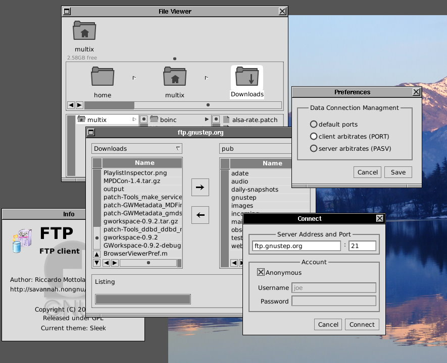

# Desktop environments 

## How do I run DietPi-Software?
DietPi-Software can be launched via the command line: `dietpi-launcher` or directly `dietpi-software`.

## LXDE - ultra lightweight desktop
LXDE is highly optimized and ultra lightweight desktop. It works well with computers on the low end of the performance spectrum such as new generation netbooks and small computers, or older resource-constrained machines.

=== "Quick start"
    After installation, desktop can be run by typing 
    ```
    startx
    ```

=== "Enable autostart"
    Using `dietpi-autostart` you can have DietPi boot directly to the desktop

=== "Official documentation"
    [LXDE Website](https://www.lxde.org) - [LXDE Wiki](https://wiki.lxde.org/en/Main_Page)


## LXQt - Optimized lightweight desktop
Optimized lightweight desktop without the bloatware. Slick and fluid GUI, however, more resource heavy than LXDE.

=== "Quick start"
    After installation, desktop can be run by typing 
    ```
    startx
    ```

=== "Enable autostart"
    Using `dietpi-autostart` you can have DietPi boot directly to the desktop

=== "Official documentation"
    [LXQt Wiki](https://wiki.debian.org/LXQt)


## MATE - Popular Gnome2 desktop.
Popular Gnome2 based desktop environment.

=== "Quick start"
    After installation, desktop can be run by typing 
    ```
    startx
    ```

=== "Enable autostart"
    Using `dietpi-autostart` you can have DietPi boot directly to the desktop

=== "Official documentation"
    [MATE Desktop website](https://mate-desktop.org/)


## XFCE - Lightweight desktop

=== "Quick start"
    After installation, desktop can be run by typing 
    ```
    startx
    ```

=== "Enable autostart"
    Using `dietpi-autostart` you can have DietPi boot directly to the desktop

=== "Official documentation"
    [XFCE website](https://wiki.debian.org/Xfce)


## GnuStep - Alternative/unique desktop

=== "Quick start"
    After installation, desktop can be run by typing 
    ```
    startx
    ```

=== "Enable autostart"
    Using `dietpi-autostart` you can have DietPi boot directly to the desktop

=== "Official documentation"
    [GNUstep website](http://gnustep.org/)



## Chromium - Optional: Web browser

Does my device support GPU acceleration?

Not all devices support GPU acceleration with Chromium.
- RPis supports native OpenGL and will be configured during installation.
- Odroids support OpenGLES and will be configured during installation.
- Other devices will most likely be limited to software rendering.

Where can I check the status of GPU acceleration?

Once Chromium is running, simply go to the following address:
    chrome://gpu

Enable support for Widevine DRM protected content on RPi:

 - Manual: [https://blog.vpetkov.net/2019/07/12/net ... -chromium/](https://blog.vpetkov.net/2019/07/12/netflix-and-spotify-on-a-raspberry-pi-4-with-latest-default-chromium/)
 - Script: [https://blog.vpetkov.net/2020/03/30/ras ... ny-others/](https://blog.vpetkov.net/2020/03/30/raspberry-pi-netflix-one-line-easy-install-along-with-hulu-amazon-prime-disney-plus-hbo-spotify-pandora-and-many-others/)

## GIMP - Optional: Image editor

MS Paint on steroids. If you need to edit pixels with a vast number of tools, GIMP is the only program you'll need. 

https://www.gimp.org/