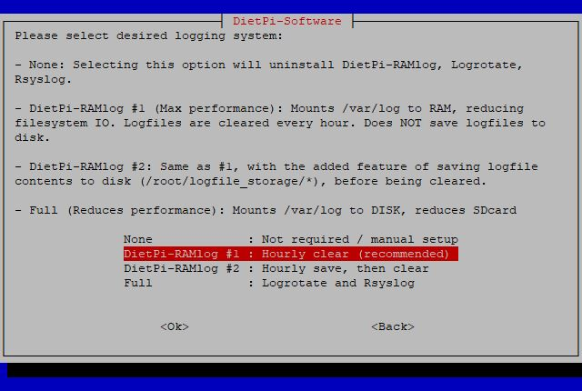
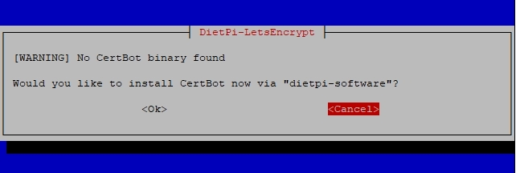

# DietPi Tools

## DietPi-Launcher

It provides an easy access to all DietPi OS tools, and it could be accessed by running next command:

``` bash
dietpi-launcher
```


## DietPi-Software

**dietpi-software** will be automatically displayed on the first login after the installation. It could be accessed at any time running next command:

``` bash
dietpi-software
```

It is one of the core tools, enabling you to install or uninstall one or more [**DietPi optimised software**](../dietpi_optimised_software/) titles.


=== "Software Optimised"

    - Begin by selecting **Software Optimized** in the main menu list and hit Enter.

    - Scroll through the list of available software - for more details check [DietPi Optimised Software](../dietpi_optimised_software/).

    The list of optimised software is long. You either browse the list or use the option **Search**.

    - To install software on your DietPi, select it in the list and press the **space bar** to add it to the installation list. If you change your mind, hit space again to remove it.

    - Once you’ve selected the software you wish to install, press the tab key on your keyboard to switch to the confirmation options at the bottom. Select **OK**, then hit enter on your keyboard to confirm.

    - To begin installing your software, select **Install** from the main menu list, then hit the Enter key. DietPi will ask you to confirm your choice(s). Select **OK**, then hit enter to begin the installation.

    The software you selected will begin to install at this point. Once the process is completed, you may be asked to restart your device. Press **OK** to confirm.

    

=== "Software Additional"

    This section provides:

    - software packages that are often used and installed via `apt install <package>`, without additional optimisation from DietPi team.
    - _or_ packages not directly required, but pulled as a dependency, like: build tools, libraries or runtime systems. E.g. packages like *Python3*, *pip*, *tcpdump* or *midnight commander* can be installed using the dialog.

    {: style="width:640px"}

=== "Search"

You can return to the **DietPi-Software** tool to make further changes at any time by typing `dietpi-software` at the terminal, or enter `dietpi-launcher` and select **DietPi-Software** tool.

=== "SSH Server"

    This lets you select your preferred SSH server. Also you can uninstall any SSH server to save memory and to exclude any external ssh based access.

    {: style="width:550px"}

=== "File Server"

    DietPi-Software allows you to easily choose a method of **accessing the files** on your DietPi system.
    Installing one of DietPi's file server choices will allow you to access and share files on your DietPi system.

    DietPi will then automatically install and setup the fileserver for you. DietPi will also clean and remove any previous fileserver from your system.

    The **default destination** directory for file servers is ***/mnt/dietpi_userdata***.

    The reasons for choosing **ProFTPD** over **Samba** may be:

    - ProFTPD outperforms Samba in all aspects of performance.
    - ProFTPD can max out the RPi 100 Mbit connection with minimal CPU usage.
    - Samba server on a RPi v1 will hit 100% CPU usage at 40 Mbit transfer rate.

    {: style="width:550px"}

    See [fileserver](../software/file_servers/) for further information.

=== "Log System"

    ***\[T.b.d.: Add log system description here\]***

    {: style="width:550px"}

=== "Webserver Preference"

    The DietPi **Webserver Preference** system allows you to choose your favourite webserver for use in DietPi installations. When you select any software for installation that requires a webserver (e.g. Pi-hole, Nextcloud, Webmin, installed via *Software Optimized*), DietPi will automatically install, configure and optimize your chosen *Webserver Preference*.  
    Basically, you will never need to manually select/install a webserver stack again. DietPi will do it all for you.

    {: style="width:550px"}

=== "User Data Location"

    In DietPi, we class user data as:

    - **Data storage for applications**. Some examples are ownCloud/Nextcloud data store, BitTorrent downloads and SQL data store (v142+).
    - The location where your **fileserver** choice will point to, if you install one (e.g.: Samba Server, ProFTPD).
    - The location where you can upload and store your **media content**, for other applications to use (e.g.: Kodi, Emby, Plex etc).

    For all software you install in dietpi-software, you can access your user data with ***/mnt/dietpi_userdata***. Regardless of where the data is physically stored, a symlink will automatically be created for you if needed.  
    To check where the physical location is, you can run the following command:  
    `readlink -f /mnt/dietpi_userdata`

    You can **move your user data** to another location (e.g. USB drive). Simply run `dietpi-software` and enter the *User data location* menu option:

    - If you need to setup a new external drive, select *Drive Manager*, to launch *DietPi-Drive Manager*.  
    - Use the *List* option to select from a list of mounted drives, or, select *Manual* for a custom location.

    DietPi will automatically move your existing user data to your new location.

    {: style="width:550px"}

**Install**  
Install selected software item(s), and these could come both from **optimised software** list or **additional software** items.

**Uninstall**  
Select one or more software items which you would like to be removed from your DietPi installation.

## Configuration

`dietpi-config` {: #DietPi-Config }

: Configure various system settings, from display / audio / network to _auto start_ options.

: 

`dietpi-drive_manager` {: #dietpi-drive_manager }

: Feature-rich drive management utility.

: 

`dietpi-autostart` {: #dietpi-autostart }

: Defines software packages to start when the DietPi OS boots up. Example, boot into the desktop with Kodi running.

: 

`dietpi-services` {: #dietpi-services }

: Provides service control, priority level tweaks and status print.

: 

`dietpi-led_control` {: #dietpi-led_control }

: 

`dietpi-cron` {: #dietpi-cron }

: Modify the start times of specific cron job groups.

: 

`dietpi-justboom` {: #dietpi-justboom }

: Change the audio settings

: 

`dietpi-sync` {: #dietpi-sync }

: Sync or duplicate a directory to another

: 

## Update & Backup

`dietpi-update` {: #dietpi-update }

: Update DietPi OS version to the latest version available.

`dietpi-backup` {: #dietpi-backup }

: Fully backups DietPi setup. It also includes the restore capability from an already made DietPi backup.

## Let's Encrypt SSL & NordVPN support

`dietpi-letsencrypt` {: #dietpi-letsencrypt }

: Access the frontend for the `Let's Encrypt` integration.

: 

`dietpi-nordvpn` {: #dietpi-nordvpn }

: 

## Miscellaneous

`dietpi-cpuinfo` {: #dietpi-cpuinfo }

: Displays CPU temperature, processor frequency, throttle level etc.

: 

`dietpi-survey` {: #dietpi-survey }

: 

`dietpi-bugreport` {: #dietpi-bugreport }

: 

`dietpi-morsecode` {: #dietpi-morsecode }

: It converts a text file into morse code.

## Maintenance

`dietpi-explorer` {: #dietpi-explorer }

: Lightweight file manager and explorer

: 

`dietpi-cleaner` {: #dietpi-cleaner }

: Clean up not necessary files from the operating system and free up valuable disk space.

: 

`dietpi-logclear` {: #dietpi-logclear }

: Clear log files in /var/log/.

: 
