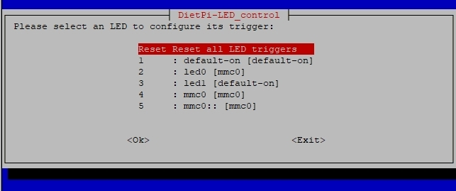

# DietPi Tools

## DietPi-Launcher

It provides an easy access to all DietPi OS tools, and it could be accessed by running next command:

``` bash
dietpi-launcher
```


## DietPi-Software

**dietpi-software** will be automatically displayed on the first login after the installation. It could be accessed at any time running next command:

``` bash
dietpi-software
```

It is one of the core tools, enabling you to install or uninstall one or more [**DietPi optimised software**](../dietpi_optimised_software/) titles.


=== "Software Optimised"

    - Begin by selecting **Software Optimized** in the main menu list and hit Enter.

    - Scroll through the list of available software - for more details check [DietPi Optimised Software](../dietpi_optimised_software).

    The list of optimised software is long. You either browse the list or use the option **Search**.

    - To install software on your DietPi, select it in the list and press the **space bar** to add it to the installation list. If you change your mind, hit space again to remove it.

    - Once you’ve selected the software you wish to install, press the tab key on your keyboard to switch to the confirmation options at the bottom. Select **OK**, then hit enter on your keyboard to confirm.

    - To begin installing your software, select **Install** from the main menu list, then hit the Enter key. DietPi will ask you to confirm your choice(s). Select **OK**, then hit enter to begin the installation.

    The software you selected will begin to install at this point. Once the process is completed, you may be asked to restart your device. Press **OK** to confirm.

    

=== "Software Additional"
    This section provides:

    - software packages that are often used and installed via ```apt install <package>```, without additional optimisation from DietPi team.
    - _or_ packages not directly required, but pulled as a dependency, like: build tools, libraries or runtime systems.

You can return to the **DietPi-Software** tool to make further changes at any time by typing `dietpi-software` at the terminal, or enter `dietpi-launcher` and select **DietPi-Software** tool.

**Install**  
Install selected software item(s), and these could come both from **optimised software** list or **additional software** items.

**Uninstall**  
Select one or more software items which you would like to be removed from your DietPi installation.

## Configuration

`dietpi-config`{: #DietPi-Config }

:    Configure various system settings, from display / audio / network to _auto start_ options.  

    

`dietpi-drive_manager`{: #dietpi-drive_manager }

:    Feature-rich drive management utility.

    

`dietpi-autostart`{: #dietpi-autostart }

:    Defines software packages to start when the DietPi OS boots up. Example, boot into the desktop with Kodi running.

    

`dietpi-services`{: #dietpi-services }

:    Provides service control, priority level tweaks and status print.

    

`dietpi-led_control`{: #dietpi-led_control }

:    

`dietpi-cron`{: #dietpi-cron }

:    Modify the start times of specific cron job groups.

    

`dietpi-justboom`{: #dietpi-justboom }

:    Change the audio settings

    

`dietpi-sync`{: #dietpi-sync }

:    Sync or duplicate a directory to another

    

## Update & Backup

`dietpi-update`{: #dietpi-update }

:    Update DietPi OS version to the latest version available.

`dietpi-backup`{: #dietpi-backup }

:    Fully backups DietPi setup. It also includes the restore capability from an already made DietPi backup.

## Let's encrypt SSL & NordVPN support

`dietpi-letsencrypt`{: #dietpi-letsencrypt }

:    Access the frontend for the `Let's Encrypt` integration.

    

`dietpi-nordvpn`{: #dietpi-nordvpn }

:    

## Miscellaneous

`dietpi-cpuinfo` {: #dietpi-cpuinfo }

:    Displays CPU temperature, processor frequency, throttle level etc.

    

`dietpi-survey`{: #dietpi-survey }

:    

`dietpi-bugreport`{: #dietpi-bugreport }

:    

`dietpi-morsecode`{: #dietpi-morsecode }

:    It converts a text file into morse code.

## Maintenance

`dietpi-explorer`{: #dietpi-explorer }

:    Lightweight file manager and explorer

    

`dietpi-cleaner`{: #dietpi-cleaner }

:    Clean up not necessary files from the operating system and free up valuable disk space.

    

`dietpi-logclear`{: #dietpi-logclear }

:    Clear log files in /var/log/.

    
