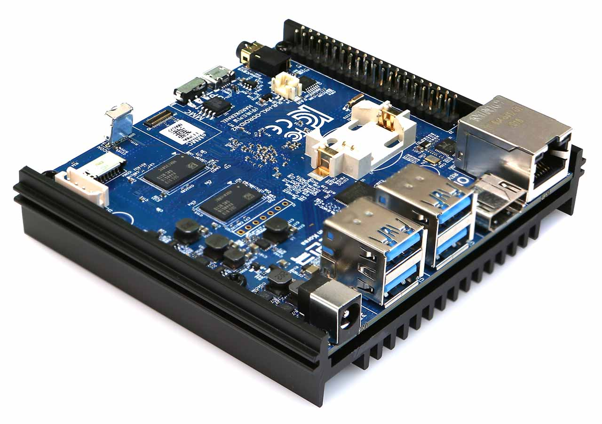
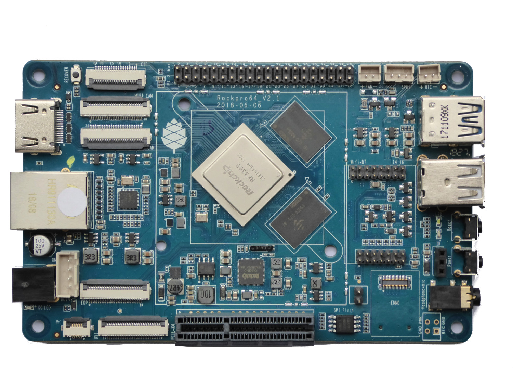
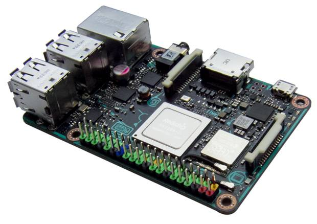

# Supported Single Board Computers (SBCs)

## Raspberry Pi
The Raspberry Pi has sold more than 31 million units since it launched in 2012. Any Raspberry Pi can serve as a secondary computer for email and web surfing. The real fun starts when you use your Pi for projects, which can range from robots to retro arcade machines to home media servers, security cameras and so on.

You can install DietPi by following the step by step [Starting guide](../user-guide_install/). 

    <table>
        <thead>
            <tr>
                <th align="left" ><strong>Product</strong></th>
                <th align="left"><strong>Description</strong></th>
            </tr>
        </thead>
        <tbody>
        <tr>
            <td align="left"><a class="table"><strong>Rasberry Pi - ALL models</strong></a></td>
            <td align="left">
                <strong>Unique DietPi image available for ALL Raspberry Pi models: Raspberry Pi 4 Model B, Raspberry Pi 3 Model A+ / B / B+, Raspberry Pi 2 Model B, Raspberry Pi 1 Model A+ / B+, Raspberry Pi Zero W</strong>: <a target="_blank" href="https://dietpi.com/downloads/images/DietPi_RPi-ARMv6-Buster.7z">Download image</a></li>
            </td>
        </tr>
        </tbody>
    </table>

DietPi runs very well on latest model **Raspberry Pi 4 Model B** (launched in 2019 / 2020)

as well as on one of the first models **Raspberry Pi 1** (launched in 2012)

and even on the compact form **Raspberry Pi Zero W**

Quick intro:

<iframe width="560" height="315" src="https://www.youtube-nocookie.com/embed/sajBySPeYH0" frameborder="0" allow="accelerometer; autoplay; encrypted-media; gyroscope" allowfullscreen></iframe>

## Odroid

ODROID single board computers are powerful, stable, and fast performing. They can function as a home theater set-top box, a general purpose computer for web browsing, gaming and socializing, a compact tool for college or office work, a prototyping device for hardware tinkering, a controller for home automation, a workstation for software development, and much more. For more details visit <a target="_blank" href="https://www.hardkernel.com">Hardkernel.com</a>

ODROID-N2 is one of the supported boards.

 It is a new generation single board computer that is more powerful, more stable, and faster performing than N1. The main CPU of the N2 is based on big. Thanks to the modern 12nm silicon technology, the A73 cores runs at 1.8Ghz without thermal throttling using the stock metal-housing heatsink allowing a robust and quiet computer.

    <table>
        <thead>
            <tr>
                <th align="left"><strong>Product</strong></th>
                <th align="left"><strong>Description</strong></th>
            </tr>
        </thead>
        <tbody>
            <tr>
                <td align="left"><a class="table" target="_blank" href=""><strong>Odroid C1</strong></a></td>
                <td align="left">
                   <strong>Download</strong>: <a target="_blank" href="https://dietpi.com/downloads/images/DietPi_OdroidC1-ARMv7-Buster.7z">DietPi image</a></li>
                </td>
            </tr>
            <tr>
                <td align="left"><a class="table" target="_blank" href=""><strong>Odroid C2</strong></a></td>
                <td align="left">
                   <strong>Download</strong>: <a target="_blank" href="https://dietpi.com/downloads/images/DietPi_OdroidC2-ARMv8-Buster.7z">DietPi image</a></li>
                </td>
            </tr>
            <tr>
                <td align="left"><a class="table" target="_blank" href=""><strong>Odroid N1</strong></a></td>
                <td align="left">
                   <strong>Download</strong>: <a target="_blank" href="https://dietpi.com/downloads/images/DietPi_OdroidN1-ARMv8-Buster.7z">DietPi image</a></li>
                </td>
            </tr>
            <tr>
                <td align="left"><a class="table" target="_blank" href=""><strong>Odroid N2</strong></a></td>
                <td align="left">
                   <strong>Download</strong>: <a target="_blank" href="https://dietpi.com/downloads/images/DietPi_OdroidN2-ARMv8-Buster.7z">DietPi image</a></li>
                </td>
            </tr>
            <tr>
                <td align="left"><a class="table" target="_blank" href=""><strong>Odroid XU3 / XU4 / MC1 / HC1 / HC2</strong></a></td>
                <td align="left">
                   <strong>Download</strong>: <a target="_blank" href="https://dietpi.com/downloads/images/DietPi_OdroidXU4-ARMv7-Buster.7z">DietPi image</a></li>
                </td>
            </tr>
        </tbody>
    </table>

## PINE64

This is where PINE64 journey began. The PINE A64 is their first Single Board Computer powered by Allwinner’s A64 Quad-Core ARM Cortex A53 64-Bit SOC. For more details visit <a target="_blank" href="https://www.pine64.org">PINE64.org</a>

The ROCKPro64 is the most powerful single board computer offered by PINE64.

It features a Rockchip RK3399 hexa-core SOC and up-to 4GB of dual-channel LPDDR4 system memory. Moreover, the board comes packed with features, including: an USB 3.0 and USB type C  with DP1.2 port, a full PCIe x4 as well as eMMC module socket. You also get a 40pin header with I2C, SPI, UARTs and GPIOs. 

The board is backwards compatible with many of the existing PINE64 peripherals, including the Wifi/BT module, camera module and LCD panel but an array of new peripherals specific for the board is also available. All this in the exact same model “A” dimension as the original PINE A64.

The ROCKPro64 4GB board is designated as LTS (long Term Supply) which means that PINE64 is committed to supply it for at least 5 years – until year 2023 and beyond.

    <table>
        <thead>
            <tr>
                <th align="left" ><strong>Product</strong></th>
                <th align="left"><strong>Description</strong></th>
            </tr>
        </thead>
        <tbody>
            <tr>
                <td align="left"><a class="table" target="_blank" href=""><strong>PINE A64</strong></a></td>
                <td align="left">
                   <strong>Download</strong>: <a target="_blank" href="https://dietpi.com/downloads/images/DietPi_PineA64-ARMv8-Buster.7z">DietPi image</a></li>
                </td>
            </tr>
            <tr>
                <td align="left"><a class="table" target="_blank" href=""><strong>PINE H64</strong></a></td>
                <td align="left">
                   <strong>Download</strong>: <a target="_blank" href="https://dietpi.com/downloads/images/testing/DietPi_PineH64-ARMv8-Buster.7z">DietPi image</a></li>
                </td>
            </tr>
            <tr>
                <td align="left"><a class="table" target="_blank" href=""><strong>Pinebook</strong></a></td>
                <td align="left">
                   <strong>Download</strong>: <a target="_blank" href="https://dietpi.com/downloads/images/DietPi_Pinebook-ARMv8-Buster.7z">DietPi image</a></li>
                </td>
            </tr>
            <tr>
                <td align="left"><a class="table" target="_blank" href=""><strong>ROCK64</strong></a></td>
                <td align="left">
                   <strong>Download</strong>: <a target="_blank" href="https://dietpi.com/downloads/images/DietPi_Rock64-ARMv8-Buster.7z">DietPi image</a></li>
                </td>
            </tr>
            <tr>
                <td align="left"><a class="table" target="_blank" href=""><strong>ROCKPro64</strong></a></td>
                <td align="left">
                   <strong>Download</strong>: <a target="_blank" href="https://dietpi.com/downloads/images/DietPi_RockPro64-ARMv8-Buster.7z">DietPi image</a></li>
                </td>
            </tr>
        </tbody>
    </table>

## ROCK PI

**Maker Friendly, IoT connectivity** enabled. ROCK Pi features maker friendly expansion options, including a 40-pin GPIO interface that allow for interfacing with a range inputs from buttons, switches, sensors, LEDs, and much more. It also features a Gbit LAN for network, with dedicated bus and controller, it works without latency under heavy load network applications. 
For more details visit [ROCK Pi](http://rockpi.org/) website.

One of the supported boards is RockPI 4.

ROCK Pi 4 is a Single Board Computer (SBC) in an ultra-small form factor that offers class-leading performance while leveraging outstanding mechanical compatibility. The ROCK Pi 4 offers makers, IoT enthusiasts, hobbyists, PC DIY enthusiasts and others a reliable and extremely capable platform for building and tinkering their ideas into reality.

    <table>
        <thead>
            <tr>
                <th align="left" ><strong>Product</strong></th>
                <th align="left"><strong>Description</strong></th>
            </tr>
        </thead>
        <tbody>
            <tr>
                <td align="left"><a class="table" target="_blank" href=""><strong>ROCK Pi 4</strong></a></td>
                <td align="left">
                   <strong>Download</strong>: <a target="_blank" href="https://dietpi.com/downloads/images/DietPi_ROCKPi4-ARMv8-Buster.7z">DietPi image</a></li>
                </td>
            </tr>
            <tr>
                <td align="left"><a class="table" target="_blank" href=""><strong>ROCK Pi S</strong></a></td>
                <td align="left">
                   <strong>Download</strong>: <a target="_blank" href="https://dietpi.com/downloads/images/testing/DietPi_ROCKPiS-ARMv8-Buster.7z">DietPi image</a></li>
                </td>
            </tr>
        </tbody>
    </table>

## FireFly
**Six-core 64Bit High Performance Open Source Platform**. For more details visit [Firefly-RK3399](http://shop.t-firefly.com/goods.php?id=45) website.

    <table>
        <thead>
            <tr>
                <th align="left" ><strong>Product</strong></th>
                <th align="left"><strong>Description</strong></th>
            </tr>
        </thead>
        <tbody>
            <tr>
                <td align="left"><a class="table" target="_blank" href=""><strong>FireFly-RK3399</strong></a></td>
                <td align="left">
                   <strong>Download</strong>: <a target="_blank" href="https://dietpi.com/downloads/images/testing/DietPi_FireflyRK3399-ARMv8-Buster.7z">DietPi image</a></li>
                </td>
            </tr>
        </tbody>
    </table>

## SPARKY SBC
Sparky Single Board Computer (SBC) is a credit card-sized board that can be used as a standalone computer, in electronics projects, games, and also in many other applications. A true open hardware, community-supported embedded computer for developers and hobbyists. The Sparky SBC has all the functionality of a basic computer. For more details visit [Allo.com - SparkySBC](https://www.allo.com/sparky/sparky-sbc.html) website.

    <table>
        <thead>
            <tr>
                <th align="left" ><strong>Product</strong></th>
                <th align="left"><strong>Description</strong></th>
            </tr>
        </thead>
        <tbody>
            <tr>
                <td align="left"><a class="table" target="_blank" href=""><strong>Sparky SBC</strong></a></td>
                <td align="left">
                   <strong>Download</strong>: <a target="_blank" href="https://dietpi.com/downloads/images/DietPi_SparkySBC-ARMv7-Stretch.7z">DietPi image</a></li>
                </td>
            </tr>
        </tbody>
    </table>

## ASUS Tinker Board
Tinker Board is a Single Board Computer (SBC) in an ultra-small form factor that offers class-leading performance while leveraging outstanding mechanical compatibility. The Tinker Board offers makers, IoT enthusiasts, hobbyists, PC DIY enthusiasts and others a reliable and extremely capable platform for building and tinkering their ideas into reality. For more details visit [Asus.com - Asus Tinker Board](https://www.asus.com/Single-Board-Computer/Tinker-Board/) website.

**Maker-Friendly, with IoT Connectivity**

Tinker Board features standard maker connectivity options, including a 40-pin GPIO interface that allow for interfacing with a range inputs from buttons, switches, sensors, LEDs, and much more. 

Tinker Board is equipped with one DSI MIPI connection for displays and touchscreens. The secondary CSI MIPI connection is for connection to compatible cameras allowing for computer vision, and much more.

**Enhanced DIY Design**

Careful consideration went into the design and development of the Tinker Board to ensure that it provides a superior user experience for first-time builders or for seasoned hobbyists. Builders appreciate the color-coded GPIO header, which makes it easy to recognize respective pin headers.

    <table>
        <thead>
            <tr>
                <th align="left" ><strong>Product</strong></th>
                <th align="left"><strong>Description</strong></th>
            </tr>
        </thead>
        <tbody>
            <tr>
                <td align="left"><a class="table" target="_blank" href=""><strong>Asus Tinker Box</strong></a></td>
                <td align="left">
                   <strong>Download</strong>: <a target="_blank" href="https://dietpi.com/downloads/images/DietPi_ASUSTB-ARMv7-Buster.7z">DietPi image</a></li>
                </td>
            </tr>
        </tbody>
    </table>

## Native PC & Virtualized environments

### Native PC images
The Native PC images are great for those occasions where SBC performance just isn't enough. Run one of these on any x86_64 PC/server and still get the same great DietPi features and experience. This image is for motherboards with UEFI boot support and onboard EMMC (eg: Z83-II, Beelink AP32 and other Intel NUC/SBC devices with onboard EMMC).

### VMware
The VMware virtual machine is great for those occasions where SBC performance just isn't enough. Run one of these on any x86_64 PC/server and still get the same great DietPi features and experience.

### VirtualBox

VirtualBox is a general-purpose full virtualizer for x86 hardware, targeted at server, desktop and embedded use.

The VirtualBox virtual machine is great for those occasions where SBC performance just isn't enough. Run one of these on any x86_64 PC/server and still get the same great DietPi features and experience.

### HyperV (community image)
The HyperV virtual machine is great for those occasions where SBC performance just isn't enough. Run one of these on any x86_64 PC/server and still get the same great DietPi features and experience.

    <table>
        <thead>
            <tr>
                <th align="left" ><strong>Product</strong></th>
                <th align="left"><strong>Description</strong></th>
            </tr>
        </thead>
        <tbody>
            <tr>
                <td align="left"><a class="table" target="_blank" href=""><strong>Native PC for BIOS/CSM</strong></a></td>
                <td align="left">
                   <strong>Download</strong>: <a target="_blank" href="https://dietpi.com/downloads/images/DietPi_NativePC-BIOS-x86_64-Buster.7z">DietPi image</a></li>
                </td>
            </tr>
            <tr>
                <td align="left"><a class="table" target="_blank" href=""><strong>Native PC UEFI</strong></a></td>
                <td align="left">
                   <strong>Download</strong>: <a target="_blank" href="https://dietpi.com/downloads/images/DietPi_NativePC-UEFI-x86_64-Buster.7z">DietPi image</a></li>
                </td>
            </tr>
            <tr>
                <td align="left"><a class="table" target="_blank" href=""><strong>VMware</strong></a></td>
                <td align="left">
                   <strong>Download</strong>: <a target="_blank" href="https://dietpi.com/downloads/images/DietPi_VMware-x86_64-Buster.7z">DietPi image</a></li>
                </td>
            </tr>
            <tr>
                <td align="left"><a class="table" target="_blank" href=""><strong>VirtualBox</strong></a></td>
                <td align="left">
                   <strong>Download</strong>: <a target="_blank" href="https://dietpi.com/downloads/images/DietPi_VirtualBox-x86_64-Buster.7z">DietPi image</a></li>
                </td>
            </tr>
            <tr>
                <td align="left"><a class="table" target="_blank" href=""><strong>Hyper-V</strong></a></td>
                <td align="left">
                   <strong>Download</strong>: <a target="_blank" href="https://github.com/yumiris/DietPi.Hyper-V/blob/master/README.md">DietPi image</a></li>
                </td>
            </tr>
        </tbody>
    </table>

## NanoPi Series (Friendly ARM)
**FriendlyARM's next generation SBC** - One of the fastest ARM SBC (RK3399) on the market today, with 2x1.8GHz A72 cores and 4x1.4GHz A53 cores. One of the smallest RK3399 SBC's available, a great addition to your SBC lineup that provides next gen SBC performance. 
For more details visit [FrienlyARM.com](https://www.friendlyarm.com/) website.

    <table>
        <thead>
            <tr>
                <th align="left" ><strong>Product</strong></th>
                <th align="left"><strong>Description</strong></th>
            </tr>
        </thead>
        <tbody>
            <tr>
                <td align="left"><a class="table" target="_blank" href=""><strong>NanoPi NEO</strong></a></td>
                <td align="left">
                   <strong>Download</strong>: <a target="_blank" href="https://dietpi.com/downloads/images/DietPi_NanoPiNEO-ARMv7-Buster.7z">DietPi image</a></li>
                </td>
            </tr>
            <tr>
                <td align="left"><a class="table" target="_blank" href=""><strong>NanoPi NEO Plus2</strong></a></td>
                <td align="left">
                   <strong>Download</strong>: <a target="_blank" href="https://dietpi.com/downloads/images/DietPi_NanoPiNEOPlus2-ARMv8-Buster.7z">DietPi image</a></li>
                </td>
            </tr>
            <tr>
                <td align="left"><a class="table" target="_blank" href=""><strong>NanoPi NEO2</strong></a></td>
                <td align="left">
                   <strong>Download</strong>: <a target="_blank" href="https://dietpi.com/downloads/images/DietPi_NanoPiNEO2-ARMv8-Buster.7z">DietPi image</a></li>
                </td>
            </tr>
            <tr>
                <td align="left"><a class="table" target="_blank" href=""><strong>NanoPi NEO2 Black</strong></a></td>
                <td align="left">
                   <strong>Download</strong>: <a target="_blank" href="https://github.com/MichaIng/DietPi/issues/3333">DietPi image</a></li>
                </td>
            </tr>
            <tr>
                <td align="left"><a class="table" target="_blank" href=""><strong>NanoPi NEO4</strong></a></td>
                <td align="left">
                   <strong>Download</strong>: <a target="_blank" href="https://dietpi.com/downloads/images/DietPi_NanoPCT4-ARMv8-Buster.7z">DietPi image</a></li>
                </td>
            </tr>
            <tr>
                <td align="left"><a class="table" target="_blank" href=""><strong>NanoPi K1 Plus</strong></a></td>
                <td align="left">
                   <strong>Download</strong>: <a target="_blank" href="https://dietpi.com/downloads/images/DietPi_NanoPiK1Plus-ARMv8-Buster.7z">DietPi image</a></li>
                </td>
            </tr>
            <tr>
                <td align="left"><a class="table" target="_blank" href=""><strong>NanoPi M1 Plus</strong></a></td>
                <td align="left">
                   <strong>Download</strong>: <a target="_blank" href="https://dietpi.com/downloads/images/DietPi_NanoPiM1Plus-ARMv7-Buster.7z">DietPi image</a></li>
                </td>
            </tr>
            <tr>
                <td align="left"><a class="table" target="_blank" href=""><strong>NanoPi M1/T1</strong></a></td>
                <td align="left">
                   <strong>Download</strong>: <a target="_blank" href="https://dietpi.com/downloads/images/DietPi_NanoPiM1-ARMv7-Buster.7z">DietPi image</a></li>
                </td>
            </tr>
            <tr>
                <td align="left"><a class="table" target="_blank" href=""><strong>NanoPi M2/T2</strong></a></td>
                <td align="left">
                   <strong>Download</strong>: <a target="_blank" href="https://dietpi.com/downloads/images/DietPi_NanoPiM2-ARMv7-Stretch.7z">DietPi image</a></li>
                </td>
            </tr>
            <tr>
                <td align="left"><a class="table" target="_blank" href=""><strong>NanoPi M3/T3</strong></a></td>
                <td align="left">
                   <strong>Download</strong>: <a target="_blank" href="https://dietpi.com/downloads/images/DietPi_NanoPiM3-ARMv8-Buster.7z">DietPi image</a></li>
                </td>
            </tr>
            <tr>
                <td align="left"><a class="table" target="_blank" href=""><strong>NanoPi M4V2</strong></a></td>
                <td align="left">
                   <strong>Download</strong>: <a target="_blank" href="https://dietpi.com/downloads/images/DietPi_NanoPiM4v2-ARMv8-Buster.7z">DietPi image</a></li>
                </td>
            </tr>
            <tr>
                <td align="left"><a class="table" target="_blank" href=""><strong>NanoPC T4</strong></a></td>
                <td align="left">
                   <strong>Download</strong>: <a target="_blank" href="https://dietpi.com/downloads/images/DietPi_NanoPCT4-ARMv8-Buster.7z">DietPi image</a></li>
                </td>
            </tr>
            <tr>
                <td align="left"><a class="table" target="_blank" href=""><strong>NanoPC M4</strong></a></td>
                <td align="left">
                   <strong>Download</strong>: <a target="_blank" href="https://dietpi.com/downloads/images/DietPi_NanoPCT4-ARMv8-Buster.7z">DietPi image</a></li>
                </td>
            </tr>
            <tr>
                <td align="left"><a class="table" target="_blank" href=""><strong>NanoPi Fire 3</strong></a></td>
                <td align="left">
                   <strong>Download</strong>: <a target="_blank" href="https://dietpi.com/downloads/images/DietPi_NanoPiFire3-ARMv8-Buster.7z">DietPi image</a></li>
                </td>
            </tr>
            <tr>
                <td align="left"><a class="table" target="_blank" href=""><strong>ZeroPi</strong></a></td>
                <td align="left">
                   <strong>Download</strong>: <a target="_blank" href="https://dietpi.com/downloads/images/DietPi_NanoPiZeroPi-ARMv7-Buster.7z">DietPi image</a></li>
                </td>
            </tr>
        </tbody>
    </table>

## Make your own distribution

Unable to find an available image for your device? No worries, DietPi can be easily installed on any device !

Simply run the DietPi PREP script [click for details](https://github.com/MichaIng/DietPi/issues/1285#issue-280771944) and follow the onscreen instructions.

_NB: End user support will be limited to issues that are DietPi specific (which excludes Kernel/GPU/onboard BT+WiFi+Audio etc from our support). GPU features are disabled for other devices (eg: Kodi, Desktop), ideal for server usage._