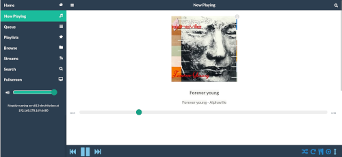
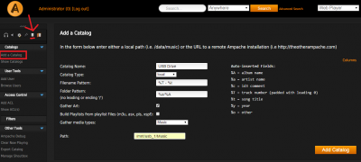
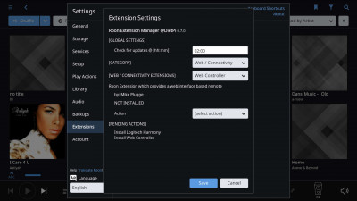
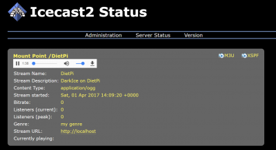
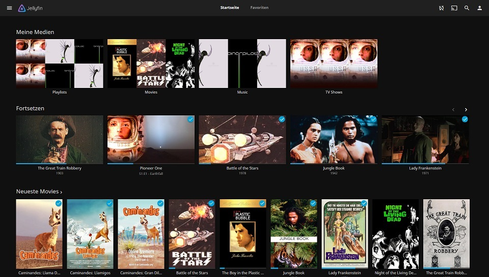

# Media Systems

## Overview

- [**Kodi - Media Centre / Player**](#kodi)
- [**ympd - Lightweight web Interface audio player for MPD**](#ympd)
- [**myMPD - Lightweight web Interface audio player for MPD**](#mympd)
- [**O!MPD - Feature-rich web Interface audio player for MPD**](#ompd)
- [**CAVA - Optional: Console-based audio visualizer for MPD**](#cava)
- [**Mopidy - Web Interface Music /Radio Player**](#mopidy)
- [**Airsonic - Feature rich media streaming server with web interface**](#airsonic)
- [**Subsonic - Feature rich media streaming server with web interface**](#subsonic)
- [**Logitech Media Server - aka LMS, Squeezebox Server**](#logitech-media-server)
- [**Squeezelite - Audio player for Logitech Media Server**](#squeezelite)
- [**Shairport Sync - AirPlay audio player with multiroom sync**](#shairport-sync)
- [**ReadyMedia - (MiniDLNA) Media streaming server (DLNA, UPnP)**](#readymedia)
- [**Ampache - Web interface media streaming server**](#ampache)
- [**Emby - Web interface media streaming server**](#emby)
- [**Plex Media Server - Web interface media streaming server**](#plex-media-server)
- [**Tautulli - Monitoring and tracking tool for Plex Media Server**](#tautulli)
- [**Murmur - Mumble VoIP Server**](#murmur)
- [**Roon Bridge - Turns your device into a Roon capable audio player**](#roon-bridge)
- [**Roon Server - Turns your device into a Roon capable audio player and Roon core**](#roon-server)
- [**Roon Extension Manager - Manage extensions from within Roon**](#roon-extension-manager)
- [**NAA Daemon - Signalyst Network Audio Adaptor (NAA)**](#naa-daemon)
- [**IceCast - Shoutcast Streaming Server, including DarkIce**](#icecast)
- [**Koel - Web interface streaming server**](#koel)
- [**GMediaRender - Resource efficient UPnP/DLNA renderer**](#gmediarender)
- [**Ubooquity - Free home server for your comics and ebooks library**](#ubooquity)
- [**Komga - Free and open source comics/mangas media server with web UI**](#komga)
- [**Raspotify - Spotify Connect client**](#raspotify)
- [**Spotify Connect Web - Web interface, client and player for Spotify Premium**](#spotify-connect-web)
- [**Jellyfin - Media streaming server including live TV**](#jellyfin)

??? info "How do I run **DietPi-Software** and install **optimised software** ?"
    To install any of the **DietPi optimised software** listed below run from the command line:

    ```
    dietpi-software
    ```

    Choose **Software Optimised** and select one or more items. Finally click on `Install`. DietPi will do all the necessary steps to install and start these software items.

    

    To see all the DietPi configurations options, review [DietPi Tools](../../dietpi_tools) section.

## Kodi

The only media centre/player you'll ever need.

{: style="width:500px"}

If you did not select Kodi to start from boot, you can modify the autostart options in `dietpi-autostart`:

- Desktop = Kodi is available via the LXDE start menu, and, desktop.
- Console = Kodi can also be run by typing `startkodi`.

## ympd

A lightweight, bare-bones, no frills HiFi music player with a web based interface. ympd is a front end for MPD.

Also installs:

- MPD (music player daemon)

{: style="width:500px"}

=== "Access to the web interface"

    URL = `http://<your.IP>:1337`

=== "Transfer/add music"

    Make sure you have one of DietPi's [File Servers](https://dietpi.com/docs/software/file_servers/) installed.  
    Folders used:

    - local = `/mnt/dietpi_userdata/Music`
    - accessed from file server = `/Music`

=== "Refresh music files / database"

    Simply select the `Update DB` button from the settings menu in ympd.

=== "DietPi-JustBoom control panel"

    - Tweak audio options on the fly with the panel.
    - Simply run `dietpi-justboom` from the command line to launch it.

        {: style="width:300px"}

## myMPD

A lightweight, bare-bones, no frills HiFi music player with a web based interface. myMPD is a front end for MPD, and a recent fork of ympd.

Also installs:

- MPD (music player daemon)

{: style="width:500px"}

=== "Access to the web interface"

    URL = `http://<your.IP>:1333`

=== "Installation notes"

    We have disabled SSL and its redirect by default with the DietPi install. This is to prevent redirects to the hostname.  
    To re-enable the SSL connection and redirect option:

    - Edit `/etc/mympd.conf`
    - Replace `ssl = false` with `ssl = true`
    - Save changes and exit
    - Restart services with `systemctl restart mympd`
    - Use the same URL address above, it will redirect to HTTPS during connection

=== "Transfer/add music"

    Make sure you have one of DietPi's [File Servers](https://dietpi.com/docs/software/file_servers/) installed.  
    Folders used:

    - local = `/mnt/dietpi_userdata/Music`
    - accessed from file server = `/Music`

=== "Refresh music files / database"

    Simply select the `Update database` option from the settings menu in myMPD.

=== "DietPi-JustBoom control panel"

    - Tweak audio options on the fly with the panel.
    - Simply run `dietpi-justboom` from the command line to launch it.

        {: style="width:300px"}

## O!MPD

A feature-rich web interface audio player for MPD. Includes song/album scraping, ideal for music catalog browsing.

Also installs:

- MPD (music player daemon)
- Web server

{: style="width:500px"}

=== "Access to the web interface"

    - URL = `http://<your.IP>/ompd`
    - Username = `admin`
    - Password = `admin`

=== "Transfer/add music"

    Make sure you have one of DietPi's [File Servers](https://dietpi.com/docs/software/file_servers/) installed.  
    Folders used by O!MPD:

    - local = `/mnt/dietpi_userdata/Music`
    - accessed from file server = `/Music`

=== "Update/scan library"

    Click the `settings` button (cog, top right).  
    Click `update`.

## CAVA

Console-based Audio Visualizer for MPD. Can be displayed in SSH terminals, consoles and LCD HATS.

Also installs:

- MPD (music player daemon)

{: style="width:500px"}

=== "Autostart option"

    If you did not select CAVA to start from boot:

    - CAVA can also be run by typing `cava`. Use `CTRL+C` to terminate.
    - You can modify the autostart options in `dietpi-autostart`.

=== "DietPi-JustBoom control panel"

    - Tweak CAVA options on the fly with the panel.
    - Simply run `dietpi-justboom` from the command line to launch it.

        {: style="width:300px"}

## Mopidy

Mopidy is a python based music player web based user interface for MPD.

{: style="width:500px"}

=== "Access to the web interface"

    - URL = `http://<your.IP>:6680/musicbox_webclient` or just `http://<your.IP>:6680`

=== "Transfer/add music"

    Make sure you have one of DietPi's [File Servers](https://dietpi.com/docs/software/file_servers/) installed.  
    Folders used by Mopidy:

    - local = `/mnt/dietpi_userdata/Music`
    - accessed from file server = `/Music`

=== "Refresh music files / database"

    This is done automatic, however, you can force an update using the command  
    `mopidyctl local scan`.

=== "Adding Mopidy extensions"

    Mopidy is highly customizable and supports various extensions from Web extensions to Backend extensions. See [*Extensions*](https://mopidy.com/ext/) for a list.

    See [*Installing extensions*](https://docs.mopidy.com/en/latest/installation/debian/?highlight=backend%20extensions#installing-extensions) for installation details.

=== "Support of codecs"

    Enable support for vast number of codecs like .m4a.   
    Many thanks to Roth for [this hint](https://dietpi.com/phpbb/viewtopic.php?f=12&t=785&p=3743#p3742).

## Airsonic

Feature rich media streaming server with a web interface. Coded in Java.

{: style="width:500px"}

=== "Access to the web interface"

    - URL = `http://<your.IP>:8080/airsonic`
    - Username = `admin`
    - Password = `admin`

=== "First run setup"

    Once connected to the web interface, we need to configure the Music directory:

    - Click the `Settings` button
    - Under `Media Folders`, replace the current music folder entry with `/mnt/dietpi_userdata/Music`, then select `Save`
    - Select `Scan media folders now` to update the library

=== "Transfer/add music"

    Make sure you have one of DietPi's [File Servers](https://dietpi.com/docs/software/file_servers/) installed.  
    Folders used by Mopidy:

    - folder = `/mnt/dietpi_userdata/Music`  

## Subsonic

Feature rich media streaming server with a web interface. Coded in Java.

{: style="width:500px"}

=== "Access to the web interface"

    - URL = `http://<your.IP>:4040`
    - Username = `admin`
    - Password = `admin`

=== "Transfer/add music"

    Make sure you have one of DietPi's [File Servers](https://dietpi.com/docs/software/file_servers/) installed.  
    Folders used by Mopidy:

    - folder = `/mnt/dietpi_userdata/Music`  

=== "Jetty http 404 error"

    This is a known issue with Subsonic and is out of my control.  
    If you experience this error while accessing the Subsonic web page, you can resolve the issue by running the following:

    ```sh
    systemctl stop subsonic
    rm -R /var/subsonic/jetty
    systemctl restart subsonic
    ```

=== "GitHub Contributions"

    Many thanks to 'thechildofroth' for his testing and fixes with the Subsonic installation.

## Logitech Media Server

Logitech Media Server (aka LMS, Squeezebox Server) is the server software that enables web interface control of:

- Software audio players: Squeezelite
- Hardware audio players from Logitech: Squeezebox, SlimDevices

Remark: If you do not own a hardware player, you can turn your DietPi system into a Squeezebox audio capable player, by selecting Squeezelite for installation in `dietpi-software`.

{: style="width:500px"}

=== "Access to the web interface"

    - URL = `http://<your.IP>:9000`

=== "Transfer/add music"

    Make sure you have one of DietPi's [File Servers](https://dietpi.com/docs/software/file_servers/) installed.  
    Folders used by Mopidy:

    - folder = `/mnt/dietpi_userdata/Music`  

=== "Change Squeezelite command line options"

    - Run `dietpi-services`
    - Select `squeezelite`
    - Select `Edit`
    - Unset and re-set the `ExecStart` entry:
      :
      ```sh
      ExecStart=
      ExecStart=/usr/bin/squeezelite [<your custom arguments>]
      ```

      : The first `ExecStart=` is required to replace the existing `ExecStart` entry instead of adding a second one.

    - Save changes with `CTRL+o` and exit `dietpi-services`
    - Restart the service: `systemctl restart squeezelite`

## Squeezelite

Squeezelite is the audio player for the Logitech Media Server.

{: style="width:500px"}

=== "Access to the web interface"

    - URL = `http://<your.IP>:9000`

=== "Transfer/add music"

    Make sure you have one of DietPi's [File Servers](https://dietpi.com/docs/software/file_servers/) installed.  
    Folders used by Mopidy:

    - folder = `/mnt/dietpi_userdata/Music`  

=== "Change Squeezelite command line options"

    - Run `dietpi-services`
    - Select `squeezelite`
    - Select `Edit`
    - Unset and re-set the `ExecStart` entry:
      :
      ```sh
      ExecStart=
      ExecStart=/usr/bin/squeezelite [<your custom arguments>]
      ```

      : The first `ExecStart=` is required to replace the existing `ExecStart` entry instead of adding a second one.

    - Save changes with `CTRL+o` and exit `dietpi-services`
    - Restart the service: `systemctl restart squeezelite`

## Shairport Sync

Shairport Sync is an AirPlay audio player which plays audio streamed from iTunes, iOS devices and third-party AirPlay sources such as ForkedDaapd and Airfoil.  
Audio played by a Shairport Sync-powered device stays synchronised with the source and hence with similar devices playing the same source. This allows for synchronised multi-room audio on multiple devices.

{: style="width:400px"}

=== "AirPlay device name"

    When searching for an Airplay device, execute `shairport-sync` on DietPi.

=== "Stream from Android and iPad/iPhone"

    There are many AirPlay players available for Android (e.g. [AirPlay For Android](https://play.google.com/store/apps/details?id=com.screen.mirroring.airplay.streamtotv&hl=de)) and iPad/iPhone (e.g. [AirPlay](https://support.apple.com/en-gb/HT204289)).  
    Download and use the player of your choice.

=== "Stream from a Windows/Mac PC"

    Airfoil is an application that will let you stream audio playback directly to any Shairport Sync device. Press play on your favourite music player (e.g.: Winamp/Spotify) and click the speaker next to the DietPi device.

=== "Audiophiles - Master music in real time"

    By using a PC + [Airfoil](https://www.rogueamoeba.com/airfoil/), you can master the music in real time using the PCs CPU. This will allow all your Shairport Sync devices to sound even better without any performance hit on the device.

=== "Multiple Shairport devices / Change Shairport Sync name"

    If you are planning to use multiple Shairport devices on the same network, please make sure the hostname of each device is unique. The hostname will also effect the `shairport-sync` name.  
    This can be completed in `dietpi-config` \> `Security Options` \> `Change Hostname`.

=== "Soxr interpolation"

    Soxr interpolation will improve the output audio quality on Shairport. However, it is extremely CPU intensive.  
    Enable Soxr:

    ```sh
    sed -i '/interpolation = /c\interpolation = "soxr";' /usr/local/etc/shairport-sync.conf
    systemctl restart shairport-sync
    ```

    Disable Soxr:

    ```sh
    sed -i '/interpolation = /c\\/\/interpolation = "soxr";' /usr/local/etc/shairport-sync.conf
    systemctl restart shairport-sync
    ```

    If you have choppy playback using Soxr:  
    Increasing the `shairplay-sync` process priority (nice) may resolve the issue.

    - Run `dietpi-services` from the terminal
    - Select `shairport-sync` via up/down buttons then press `Enter`
    - Select `CPU Nice` via up/down buttons then press `Enter`
    - Select `-20 : (Highest priority)` via up button, then press `Enter`

    DietPi will then automatically apply and set the nice level.

    If the choppy playback continues, the CPU most likely is insufficient for the processing required for Soxr. Then Soxr should be disabled.

## ReadyMedia

Stream your shared media to any DLNA/UPnP capable device.

{: style="width:200px"}

=== "Access to ReadyMedia status"

    - URL = `http://<your.IP>:8200`

=== "Transfer media files to ReadyMedia"

    Make sure you have one of DietPi's [File Servers](https://dietpi.com/docs/software/file_servers/) installed.  
    Folders used by ReadyMedia:

    - `/Music`
    - `/Pictures`
    - `/Video`

=== "Refresh the ReadyMedia database"

    The database can be refreshed with this command:

    ```sh
    rm -r /mnt/dietpi_userdata/.MiniDLNA_Cache/* && systemctl restart minidlna
    ```

***

Available UPnP clients: <https://www.wikipedia.org/wiki/List_of_UPnP_AV_media_servers_and_clients#UPnP_AV_clients>

## Ampache

A web based audio/video streaming application and file manager allowing you to access your music & videos from anywhere, using almost any internet enabled device.

Also Installs:

- Webserver stack

{: style="width:500px"}

=== "Access to the web interface"

    - URL = `http://<your.IP>/ampache`
    - Username = `admin`
    - Password = `dietpi`

=== "Transfer media files to ReadyMedia"

    Make sure you have one of DietPi's [File Servers](https://dietpi.com/docs/software/file_servers/) installed.  
    Folders used by Ampache:

    - audio = `/mnt/dietpi_userdata/Music`
    - videos = `/mnt/dietpi_userdata/Video`

=== "Scan for media, update Ampache database"

    DietPi will automatically add various catalogue directories to Ampache during installation. You can modify these directories as needed before running your first scan.  
    To start the scan and import your media into Ampache:

    - Select the `admin` button.
    - Select `show catalogues` from the left hand side.
    - Select `Update all`.

    {: style="width:500px"}

=== "Add custom media folders"

    - Select the `admin` button.
    - Select `add a catalogue` from the left hand side.
    - Enter the details of your path (See the image example below to add your USB drive music folder to Ampache).
    - Select the `add catalogue` button.

    Remark: For Ampache to access custom directories, you must ensure read access to the folder, e.g. by:

    ```sh
    chmod -R 775 /my/directory
    ```

    {: style="width:500px"}

=== "Enable additional file formats via transcoding"

    - <https://github.com/ampache/ampache/wiki/Transcoding>
    - E.g. to allow .m4a playback:

      ```sh
      G_CONFIG_INJECT 'transcode_m4a[[:blank:]]' 'transcode_m4a = allowed' /var/www/ampache/config/ampache.cfg.php
      ```

=== "Update Ampache"

    To update Ampache to the current version, execute  
    `dietpi-software reinstall 40`.

## Emby

A web interface media streaming server. Think Kodi, but using any device with a web browser.

??? note "Transcoding performance on SBC"

    Video transcoding performance on SBC devices is sluggish and may stutter, even on the RPi 3:  
    <https://github.com/MichaIng/DietPi/issues/310#issuecomment-216262850>  
    SBCs should be fine for Music only.  
    A Virtual Machine is highly recommended for Video transcoding:  
    <https://github.com/MichaIng/DietPi/issues/310#issuecomment-219067830>

{: style="width:500px"}

=== "Access to the web interface"

    URL = `http://<your.IP>:8096`

=== "First run setup"

    Once connected to the web interface, simply follow the on screen instructions.  
    When you reach Setup your media libraries:

    ```sh
    /mnt/dietpi_userdata/Music
    /mnt/dietpi_userdata/Video
    ```

    You can also mount Samba/NFS shares by running `dietpi-drive_manager` and selecting `Mount network drive` from the menu.

=== "Transfer media files to your device"

    Make sure you have one of DietPi's [File Servers](https://dietpi.com/docs/software/file_servers/) installed.  
    Folders used by Emby:

    - audio = `/mnt/dietpi_userdata/Music`
    - videos = `/mnt/dietpi_userdata/Video`

=== "Update"

    To update the Emby Server version simply reinstall Emby Server to update it to newest version. It will preserve any existing data and settings:  
    `dietpi-software reinstall 41`

***

YouTube video: [DietPi Emby Media Server Setup on Raspberry Pi 3 B Plus](https://www.youtube.com/watch?v=zEcNNLCFngI)

## Plex Media Server

Plex organizes your video, music, and photo collections and streams them to all of your screens. Also known as a "Web interface media streaming server".

{: style="width:500px"}

=== "Access to the web interface"

    URL = `http://<your.IP>:32400/web`

=== "First run setup"

    Please follow the onscreen instructions to complete the setup wizard:

    - Create your Plex account by signing up.
    - Give your server a name (e.g.: `DietPi-Plex`)
    - Click `library` to setup your media locations:

        ```sh
        /mnt/dietpi_userdata/Music
        /mnt/dietpi_userdata/Video
        ```

    You can also mount Samba/NFS shares by running `dietpi-drive_manager` and selecting `Mount network drive` from the menu.

=== "Transfer media files to your device"

    Make sure you have one of DietPi's [File Servers](https://dietpi.com/docs/software/file_servers/) installed.  
    Folders used by Plex Media Server:

    - audio = `/mnt/dietpi_userdata/Music`
    - videos = `/mnt/dietpi_userdata/Video`

***

YouTube video (german language): [`Raspberry Pi 4 - Plex TV Media Server unter DietPi installieren und Zugriff von aussen (FritzBox)`](https://www.youtube.com/watch?v=EElrNjXc3aA&list=PLQIL7cyHMGboXtOzwAcX4hGPW6ECbVinp&index=4)

## Tautulli

A Python-based monitoring and tracking tool for Plex Media Server.

{: style="width:500px"}

=== "Access to the web interface"

    URL = `http://<your.IP>:8181`

=== "Access to the log files"

    `/mnt/dietpi_userdata/plexpy/logs/`

## Murmur

Turn your device into a lightweight Mumble VoIP server.

{: style="width:100px"}

=== "Murmur Server connection details"

    Use the following credentials to connect clients to the Murmur server:

    - URL = `http://<your.IP>:64738`
    - Password = No password required
    - Superuser Password = `dietpi`

=== "Change Murmur Server settings"

    You will need to edit the Murmur config file:

    ```sh
    nano /etc/mumble-server.ini
    #Restart service
    systemctl restart mumble-server
    ```

## Roon Bridge

Turns your SBC into a Roon capable audio player. By using the main Roon application on another device, you can stream your music catalog directly to the Roon Bridge running on your SBC.

{: style="width:150px"}

{: style="width:500px"}

=== "More information on Roon"

    Can be found there: <https://roonlabs.com/index.html>  
    See also [YouTube videos from David Snyder](https://www.youtube.com/c/dsnyder0cnn/search?query=roon)

=== "Requirements"

    Roon on another system (e.g.: Windows PC) to control the player.  
    [Roon License](https://roonlabs.com/pricing) (free trial is also available).

## Roon Server

Turns your device into a Roon capable audio player and core server.

{: style="width:150px"}

{: style="width:500px"}

=== "Install a Roon Remote on another system"

    You can use the Roon Remote apps to control and configure the Roon Server:  
    <https://roonlabs.com/downloads.html>

=== "Recommended Music Storage Directory"

    When configuring your Roon Server, we highly recommend using the DietPi user data directory. This will allow you to transfer music over the network easily (see Transfer Music below), and storing the music on your Roon Server system:  
    `/mnt/dietpi_userdata/Music`

=== "Transfer media files to your device"

    Make sure you have one of DietPi's [File Servers](https://dietpi.com/docs/software/file_servers/) installed.  
    Folders used by Roon Server:

    - Music folder = `/mnt/dietpi_userdata/Music`
    - Accessed from file server = `/Music`

## Roon Extension Manager

At startup the Roon Extension Manager accesses a repository containing the community developed extensions. Via `Settings` \> `Extensions` within Roon the repository can be viewed and an extension can be selected to perform a certain action.

{: style="width:150px"}

{: style="width:500px"}

***

Details and usage information: <https://community.roonlabs.com/t/roon-extension-manager-v0-11-8/26632>  
Credits: Many thanks to @JanKoudijs for contributing this into DietPi

## NAA Daemon

Signalyst Network Audio Adapter (NAA) daemon allows you to stream music from an HQPlayer source (like Windows) and output directly from your DietPi device. Features DRC, high quality up-sampling (like 192 kHz) and more.  
Also works with Roon.

{: style="width:500px"}

=== "HQPlayer Desktop (Windows)"

    This will allow you to stream audio from your Windows PC, to the NAA Daemon on the DietPi device.

    - Download and install HQPlayer Desktop for Windows:  
      <https://www.signalyst.eu/consumer.html>
    - Run the program
    - To configure HQPlayer to use the NAA Daemon on the DietPi device:
        - Select `File` then `Settings`
        - Under `Backend`, select `NetworkAudioAdapter`. The DietPi device should be detected automatically.
        - Click `OK` to save changes

=== "How do I use Roon and HQPlayer together?"

    Guide: <https://help.roonlabs.com/portal/en/kb/articles/faq-how-do-i-use-roon-and-hqplayer-together>

=== "Update method"

    `dietpi-software reinstall 124`

***

Website: <https://www.signalyst.eu/consumer.html>  

## IceCast

Shoutcast streaming server, includes DarkIce for audio input (e.g.: microphone).

{: style="width:500px"}

=== "Installation notes"

    DietPi will attempt to detect mic input during installation, and apply to DarkIce. If a microphone was not available, or you experience issue, check available microphones with: `arecord -l`

    - Then edit the device entry in `/etc/darkice.cfg`, or  
    - Simple copy and paste:

        ```sh
        sed -i "/^device[[:blank:]]/c\device = hw:$(arecord -l | mawk -F'[ :]' '/card/{print $2;exit}'),0" /etc/darkice.cfg
        ```

    - Restart services: `dietpi-services restart`

    We created a `systemd` service for DarkIce, DietPi will automatically start it. You can check its status by running the following command:

    ```sh
    systemctl -l status darkice
    ```

=== "Access IceCast web interface"

    - URL = `http://<your.IP>:8000`
    - Admin user = `admin`
    - Admin password = randomly generated, use code below to view:

        ```sh
        grep admin-password /etc/icecast2/icecast.xml
        ```

    - Source password = `dietpi`
    - Relay password = `dietpi`

=== "Access Recording File"

    This is disabled by default.

    - A recording of the stream can be enabled by edit of `/etc/darkice.cfg`, then uncomment

        ```
        localDumpFile = /mnt/dietpi_userdata/darkice_recording.ogg
        ```

    - Restart services: `dietpi-services restart`
    - A recording will then be saved in the following location: `/mnt/dietpi_userdata/darkice_recording.ogg`

## Koel

Web interface music streamer.

{: style="width:500px"}

=== "Access to the web interface"

    - URL = `http://<your.IP>:8000`
    - Email address = The one you entered during installation
    - Password = The one you entered during installation

=== "First run setup"

    Configure Koel to use the DietPi user data (music) directory:

    - In the web interface, on the left hand side click `settings`
    - Under `Media Path`, enter `/mnt/dietpi_userdata/Music`
    - Then click `Scan`

=== "Transfer media files to your device"

    Make sure you have one of DietPi's [File Servers](https://dietpi.com/docs/software/file_servers/) installed.  
    Folders used by Koel:

    - local = `/mnt/dietpi_userdata/Music`
    - accessed from file server = `/Music`

## GMediaRender

A DLNA audio render/endpoint. Allows you to stream and play music, from another device, such as [BubbleUPnP](https://play.google.com/store/apps/details?id=com.bubblesoft.android.bubbleupnp).

{: style="width:150px"}

## Ubooquity

Ubooquity is a free home server for your comics and ebooks library, with remote web interface viewing.

{: style="width:600px"}

=== "Access to the web interface"

    - Admin page = `http://<your.IP>:2038/admin`
    - Library view page = `http://<your.IP>:2039`

=== "Transfer ebooks/comics to your device"

    Make sure you have one of DietPi's [File Servers](https://dietpi.com/docs/software/file_servers/) installed.  

    - Use the following folders = `/mnt/dietpi_userdata/ebooks` and `/mnt/dietpi_userdata/comics`
    - Then use the admin page, to set the above locations for ebook and comic storage
    - Run a scan in the admin page to update the database

=== "Update to the latest version"

    `dietpi-software reinstall 80`

***

YouTube video: [DietPi Ubooquity Comics and Ebook Reader on Raspberry Pi 3 B Plus](https://www.youtube.com/watch?v=xUewleo7f2Q)

## Komga

Free and open source comics/mangas media server with web UI.

{: style="width:500px"}

=== "Access to the web interface"

    - URL = `http://<your.IP>:2037`

=== "Data directory"

    `/mnt/dietpi_userdata/komga`

=== "Configuration file"

    `/mnt/dietpi_userdata/komga/application.yml`

=== "View logs"

    `journalctl -u komga`

    If you require file logging, set a path via `config` file, like `logging:` \> `file:` \> `name: /var/log/komga/komga.log`, assure that the directory exists and the `komga` user or group has write permissions.

=== "Update to latest version"

    `dietpi-software reinstall 179`

***

Official documentation: <https://komga.org/guides>  
Source code: <https://github.com/gotson/komga>

## Raspotify

Spotify Connect client for the Raspberry Pi that Just Works™.

!!! note "You will need a Spotify Premium account in order to use the Spotify Connect client."

{: style="width:250px"}

Raspotify should work straight out of the box.

=== "Changing options"

    However, you can change the available options in:

    - `/etc/default/raspotify`

    Then restart services with:

    ```sh
    systemctl restart raspotify
    ```

***

Source code: <https://github.com/dtcooper/raspotify>

## Spotify Connect Web

Spotify Connect Web is a console client and player for Spotify Connect including a web frontend.

=== "Access to the web interface"

    - URL = `http://<your.IP>:4000`

=== "Generate the Spotify API key"

    The generation of the `spotify_appkey.key` is required to allow the application, access to Spotify API using your account.

    Fill out the application form <https://developer.spotify.com/documentation/general/guides/app-settings/#register-your-app>.  
    Wait for it to be "accepted"

=== "Transfer Spotify API key"

    Make sure you have one of DietPi's [File Servers](https://dietpi.com/docs/software/file_servers/) installed.  
    Copy the `spotify_appkey.key` to the following folder:

    - folder = `/mnt/dietpi_userdata/spotify-connect-web`
    - accessed from file server = `/spotify-connect-web`

=== "View service logs"

    View the service logs via:

    ```sh
    journalctl -u spotify-connect-web
    ```

=== "Service handling"

    There are some typical service tasks available:

    - Manually start the service:

        ```sh
        systemctl start spotify-connect-web
        ```

    - Manually stop the service

        ```sh
        systemctl stop spotify-connect-web
        ```

    - Manually restart the service

        ```sh
        systemctl restart spotify-connect-web
        ```

***

Source code: <https://github.com/Fornoth/spotify-connect-web>  
Quick start documentation: <https://developer.spotify.com/documentation/web-api/quick-start>

## Jellyfin

A FOSS web interface media streaming server, including live TV, forked from Emby.

{: style="width:600px"}

=== "Access to the web interface"

    URL = `http://<your.IP>:8096`

=== "View service logs"

    - Service:

        ```sh
        journalctl -u jellyfin
        ```

    - Binary: `/var/log/jellyfin/`

=== "Data directory"

    `/mnt/dietpi_userdata/jellyfin`

=== "Update to latest version"

    Code: Select all

    ```
    apt update
    apt install jellyfin jellyfin-ffmpeg
    ```

***

Source code: <https://github.com/jellyfin/jellyfin>

[Return to the **Optimised Software list**](../../dietpi_optimised_software)
