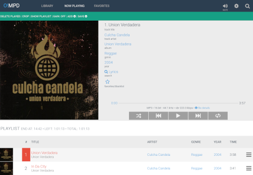
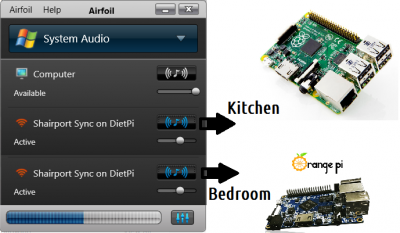
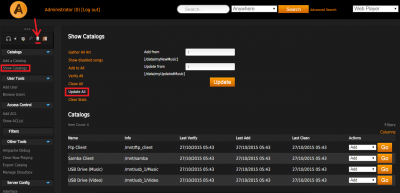
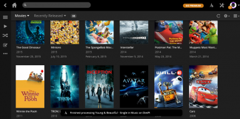
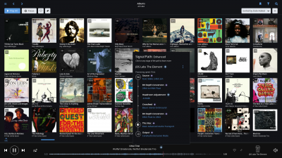

# Media Systems

## Overview

- [**Kodi - Media Centre / Player**](#kodi-media-centre-player)
- [**ympd - Lightweight web Interface audio player for MPD**](#ympd-lightweight-web-interface-audio-player-for-mpd)
- [**myMPD - Lightweight web Interface audio player for MPD**](#mympd-lightweight-web-interface-audio-player-for-mpd)
- [**O!MPD - Feature-rich web Interface audio player for MPD**](#ompd-feature-rich-web-interface-audio-player-for-mpd)
- [**CAVA - Optional: Console-based audio visualizer for MPD**](#cava-optional-console-based-audio-visualizer-for-mpd)
- [**Mopidy - Web Interface Music /Radio Player**](#mopidy-web-interface-music-radio-player)
- [**Airsonic - Feature rich media streaming server with web interface**](#airsonic-feature-rich-media-streaming-server-with-web-interface)
- [**Subsonic - Feature rich media streaming server with web interface**](#subsonic-feature-rich-media-streaming-server-with-web-interface)
- [**Logitech Media Server - aka LMS, Squeezebox Server**](#logitech-media-server-aka-lms-squeezebox-server)
- [**SqueezeLite - Audio player for Logitech Media Server**](#squeezelite-audio-player-for-logitech-media-server)
- [**Shairport Sync - AirPlay audio player with multiroom sync**](#shairport-sync-airplay-audio-player-with-multiroom-sync)
- [**ReadyMedia - (MiniDLNA) Media streaming server (DLNA, UPnP)**](#readymedia-minidlna-media-streaming-server-dlna-upnp)
- [**Ampache - Web interface media streaming server**](#ampache-web-interface-media-streaming-server)
- [**Emby - Web interface media streaming server**](#emby-web-interface-media-streaming-server)
- [**Plex Media Server - Web interface media streaming server**](#plex-media-server-web-interface-media-streaming-server)
- [**Tautulli - Monitoring and tracking tool for Plex Media Server**](#tautulli-monitoring-and-tracking-tool-for-plex-media-server)
- [**Murmur - Mumble VoIP Server**](#murmur-mumble-voip-server)
- [**Roon Bridge - Turns your device into a Roon capable audio player**](#roon-bridge-turns-your-device-into-a-roon-capable-audio-player)
- [**Roon Server - Turns your device into a Roon capable audio player and Roon core**](#roon-server-turns-your-device-into-a-roon-capable-audio-player-and-roon-core)
- [**Roon Extension Manager - Manage extensions from within Roon**](#roon-extension-manager-manage-extensions-from-within-roon)
- [**NAA Daemon - Signalyst Network Audio Adaptor (NAA)**](#naa-daemon-signalyst-network-audio-adaptor-naa)
- [**IceCast - Shoutcast Streaming Server, including DarkIce**](#icecast-shoutcast-streaming-server-including-darkice)
- [**jRiver - Media Center**](#jriver-media-center)
- [**Koel - Web interface streaming server**](#koel-web-interface-streaming-server)
- [**GMediaRender - Resource efficient UPnP/DLNA renderer**](#gmediarender-resource-efficient-upnpdlna-renderer)
- [**Ubooquity - Free home server for your comics and ebooks library**](#ubooquity-free-home-server-for-your-comics-and-ebooks-library)
- [**Komga - Free and open source comics/mangas media server with web UI**](#komga-free-and-open-source-comicsmangas-media-server-with-web-ui)

??? info "How do I run **DietPi-Software** and install **optimised software** ?"
    To install any of the **DietPi optimised software** listed below run from the command line:

    ```
    dietpi-software
    ```

    Choose **Software Optimised** and select one or more items. Finally click on `Install`. DietPi will do all the necessary steps to install and start these software items.

    

    To see all the DietPi configurations options, review [DietPi Tools](../../dietpi_tools) section.

## Kodi - Media Centre / Player

The only media centre/player you'll ever need.

{: style="width:500px"}

If you did not select Kodi to start from boot, you can modify the autostart options in `dietpi-autoStart`:

- Desktop = Kodi is available via the LXDE start menu, and, desktop.
- Console = Kodi can also be run by typing `startkodi`.

## ympd - Lightweight web Interface audio player for MPD

A lightweight, bare-bones, no frills HiFi music player with a web based interface. ympd is a front end for MPD.

Also installs:

- MPD (music player daemon)

{: style="width:500px"}

=== "Access to the web interface"

    URL = `http://<your.IP>:1337`

=== "Transfer/add music"

    Make sure you have one of DietPi's [File Servers](https://dietpi.com/docs/software/file_servers/) installed.  
    Folders used:

    - local = `/mnt/dietpi_userdata/Music`  
      accessed from file server = `/Music`

=== "Refresh music files / database"

    Simply select the `Update DB` button from the settings menu in ympd.

=== "DietPi-JustBoom control panel"

    - Tweak audio options on the fly with the panel.
    - Simply run `dietpi-justboom` from the command line to launch it.

    {: style="width:300px"}

## myMPD - Lightweight web Interface audio player for MPD

A lightweight, bare-bones, no frills HiFi music player with a web based interface. myMPD is a front end for MPD, and a recent fork of ympd.

Also installs:

- MPD (music player daemon)

{: style="width:500px"}

=== "Access to the web interface"

    URL = `http://<your.IP>:1333`

=== "Installation notes"

    We have disabled SSL and its redirect by default with the DietPi install. This is to prevent redirects to the hostname.  
    To re-enable the SSL connection and redirect option:

    - Edit `/etc/mympd.conf`
    - Replace `ssl = false` with `ssl = true`
    - Save changes and exit
    - Restart services with `dietpi-services restart`
    - Use the same URL address above, it will redirect to HTTPS during connection

=== "Transfer/add music"

    Make sure you have one of DietPi's [File Servers](https://dietpi.com/docs/software/file_servers/) installed.  
    Folders used:

    - local = `/mnt/dietpi_userdata/Music`  
      accessed from file server = `/Music`

=== "Refresh music files / database"

    Simply select the `Update database` option from the settings menu in myMPD.

=== "DietPi-JustBoom control panel"

    - Tweak audio options on the fly with the panel.
    - Simply run `dietpi-justboom` from the command line to launch it.

    {: style="width:300px"}

## O!MPD - Feature-rich web Interface audio player for MPD

A feature-rich web interface audio player for MPD. Includes song/album scraping, ideal for music catalog browsing.

Also installs:

- MPD (music player daemon)
- Web server

{: style="width:500px"}

=== "Access to the web interface"

    - URL = `http://<your.IP>/ompd`
    - Username = `admin`
    - Password = `admin`

=== "Transfer/add music"

    Make sure you have one of DietPi's [File Servers](https://dietpi.com/docs/software/file_servers/) installed.  
    Folders used by O!MPD:

    - local = `/mnt/dietpi_userdata/Music`  
      accessed from file server = `/Music`

=== "Update/scan library"

    Click the `settings` button (cog, top right).  
    Click `update`.

## CAVA - Optional: Console-based audio visualizer for MPD

Console-based Audio Visualizer for MPD. Can be displayed in SSH terminals, consoles and LCD HATS.

Also installs:

- MPD (music player daemon)

{: style="width:500px"}

=== "Autostart option"

    If you did not select CAVA to start from boot:

    - CAVA can also be run by typing `cava`. Use `CTRL+C` to terminate.
    - You can modify the autostart options in `dietpi-autostart`.

=== "DietPi-JustBoom control panel"

    - Tweak CAVA options on the fly with the panel.
    - Simply run `dietpi-justboom` from the command line to launch it.

    {: style="width:300px"}

## Mopidy - Web Interface Music /Radio Player

Mopidy is a python based music player web based user interface for MPD.

{: style="width:500px"}

=== "Access to the web interface"

    - URL = `http://<your.IP>:6680/musicbox_webclient` or just `http://<your.IP>:6680`

=== "Transfer/add music"

    Make sure you have one of DietPi's [File Servers](https://dietpi.com/docs/software/file_servers/) installed.  
    Folders used by Mopidy:

    - local = `/mnt/dietpi_userdata/Music`  
      accessed from file server = `/Music`

=== "Refresh music files / database"

    This is done automatic, however, you can force an update using the command  
    `mopidyctl local scan`.

=== "Adding Mopidy extensions"

    Mopidy is highly customizable and supports various extensions from Web extensions to Backend extensions. See [*Extensions*](https://mopidy.com/ext/) for a list.

    See [*Installing extensions*](https://docs.mopidy.com/en/latest/installation/debian/?highlight=backend%20extensions#installing-extensions) for installation details.

=== "Support of codecs"

    Enable support for vast number of codecs like .m4a.   
    Many thanks to Roth for [this hint](https://dietpi.com/phpbb/viewtopic.php?f=12&t=785&p=3743#p3742).

## Airsonic - Feature rich media streaming server with web interface

Feature rich media streaming server with a web interface. Coded in Java.

{: style="width:500px"}

=== "Access to the web interface"

    - URL = `http://<your.IP>:8080/airsonic`
    - Username = `admin`
    - Password = `admin`

=== "First run setup"

    Once connected to the web interface, we need to configure the Music directory:

    - Click the `Settings` button
    - Under `Media Folders`, replace the current music folder entry with `/mnt/dietpi_userdata/Music`, then select `Save`
    - Select `Scan media folders now` to update the library

=== "Transfer/add music"

    Make sure you have one of DietPi's [File Servers](https://dietpi.com/docs/software/file_servers/) installed.  
    Folders used by Mopidy:

    - folder = `/mnt/dietpi_userdata/Music`  

## Subsonic - Feature rich media streaming server with web interface

Feature rich media streaming server with a web interface. Coded in Java.

{: style="width:500px"}

=== "Access to the web interface"

    - URL = `http://<your.IP>:4040`
    - Username = `admin`
    - Password = `admin`

=== "Transfer/add music"

    Make sure you have one of DietPi's [File Servers](https://dietpi.com/docs/software/file_servers/) installed.  
    Folders used by Mopidy:

    - folder = `/mnt/dietpi_userdata/Music`  

=== "Jetty http 404 error"

    This is a known issue with Subsonic and is out of my control.  
    If you experience this error while accessing the Subsonic webpage, you can resolve the issue by running the following:

    ```sh
    systemctl stop subsonic
    rm -R /var/subsonic/jetty
    systemctl restart subsonic
    ```

=== "GitHub Contributions"

    Many thanks to 'thechildofroth' for his testing and fixes with the Subsonic installation.

## Logitech Media Server - aka LMS, Squeezebox Server

Logitech Media Server is the server software that enables web interface control of:

- Software audio players: SqueezeLite
- Hardware audio players from Logitech: Squeezebox, SlimDevices

Remark: If you do not own a hardware player, you can turn your DietPi system into a Squeezebox audio capable player, by selecting SqueezeLite for installation in `dietpi-software`.

{: style="width:500px"}

=== "Access to the web interface"

    - URL = `http://<your.IP>:9000`

=== "Transfer/add music"

    Make sure you have one of DietPi's [File Servers](https://dietpi.com/docs/software/file_servers/) installed.  
    Folders used by Mopidy:

    - folder = `/mnt/dietpi_userdata/Music`  

=== "Change SqueezeLite command line options"

    - Run `dietpi-services`
    - Select `squeezelite`
    - Select `Edit`
    - Unset and re-set the ExecStart entry:
      :
      ```sh
      ExecStart=
      ExecStart=/usr/bin/squeezelite [<your custom arguments>]
      ```

      : The first `ExecStart=` is required to replace the existing `ExecStart` entry instead of adding a second one.

    - Save changes with `CTRL+o` and exit `dietpi-services`
    - Restart the service: `systemctl restart squeezelite`

## SqueezeLite - Audio player for Logitech Media Server

SqueezeLite is the audio player for the Logitech Media Server.

{: style="width:500px"}

=== "Access to the web interface"

    - URL = `http://<your.IP>:9000`

=== "Transfer/add music"

    Make sure you have one of DietPi's [File Servers](https://dietpi.com/docs/software/file_servers/) installed.  
    Folders used by Mopidy:

    - folder = `/mnt/dietpi_userdata/Music`  

=== "Change SqueezeLite command line options"

    - Run `dietpi-services`
    - Select `squeezelite`
    - Select `Edit`
    - Unset and re-set the ExecStart entry:
      :
      ```sh
      ExecStart=
      ExecStart=/usr/bin/squeezelite [<your custom arguments>]
      ```

      : The first `ExecStart=` is required to replace the existing `ExecStart` entry instead of adding a second one.

    - Save changes with `CTRL+o` and exit `dietpi-services`
    - Restart the service: `systemctl restart squeezelite`

## Shairport Sync - AirPlay audio player with multiroom sync

Shairport Sync is an AirPlay audio player which plays audio streamed from iTunes, iOS devices and third-party AirPlay sources such as ForkedDaapd and Airfoil.  
Audio played by a Shairport Sync-powered device stays synchronised with the source and hence with similar devices playing the same source. This allows for synchronised multi-room audio on multiple devices.

{: style="width:400px"}

=== "AirPlay device name"

    When searching for an Airplay device, execute `shairport-sync` on DietPi.

=== "Stream from Android and iPad/iPhone"

    There are many AirPlay players available for Android (e.g. [AirPlay For Android](https://play.google.com/store/apps/details?id=com.screen.mirroring.airplay.streamtotv&hl=de)) and iPad/iPhone (e.g. [AirPlay](https://support.apple.com/en-gb/HT204289)).  
    Download and use the player of your choice.

=== "Stream from a Windows/Mac PC"

    Airfoil is an application that will let you stream audio playback directly to any Shairport Sync device. Press play on your favourite music player (eg: winamp/spotify) and click the speaker next to the DietPi device.

=== "Audiophiles - Master music in realtime"

    By using a PC + Airfoil, you can master the music in realtime using the PCs CPU. This will allow all your Shairport Sync devices to sound even better without any performance hit on the device.  
    FuzonMp3 is a lightweight music player coded in C++ that sounds "as it should" and supports VST plugins. iZotope Ozone 5 is highly recommended for audiophiles.

=== "Multiple Shairport devices / Change Shairport Sync name"

    If you are planning to use multiple Shairport devices on the same network, please make sure the hostname of each device is unique. The hostname will also effect the `shairport-sync` name.  
    This can be completed in `dietpi-config` \> `Security Options` \> `Change Hostname`.

=== "Soxr interpolation"

    Soxr interpolation will improve the output audio quality on Shairport. However, it is extremely CPU intensive.  
    Enable Soxr:

    ```sh
    sed -i '/interpolation = /c\interpolation = "soxr";' /usr/local/etc/shairport-sync.conf
    systemctl restart shairport-sync
    ```

    Disable Soxr:

    ```sh
    sed -i '/interpolation = /c\\/\/interpolation = "soxr";' /usr/local/etc/shairport-sync.conf
    systemctl restart shairport-sync
    ```

    If you have choppy playback using Soxr:  
    Increasing the `shairplay-sync` process priority (nice) may resolve the issue.

    - Run `dietpi-services` from the terminal
    - Select `shairport-sync` via up/down buttons then press `Enter`
    - Select `CPU Nice` via up/down buttons then press `Enter`
    - Select `-20 : (Highest priority)` via up button, then press `Enter`

    DietPi will then automatically apply and set the nice level.

    If the choppy playback continues, the CPU most likely is insufficient for the processing required for soxr. Then soxr should be disabled.

## ReadyMedia - (MiniDLNA) Media streaming server (DLNA, UPnP)

Stream your shared media to any DLNA/UPnP capable device.

{: style="width:200px"}

=== "Access to ReadyMedia status"

    - URL = `http://<your.IP>:8200`

=== "Transfer media files to ReadyMedia"

    Make sure you have one of DietPi's [File Servers](https://dietpi.com/docs/software/file_servers/) installed.  
    Folders used by ReadyMedia:

    - folder = `/Music /Pictures /Video`

=== "Refresh the ReadyMedia database"

    The database can be refreshed with this command:

    ```sh
    rm -r /mnt/dietpi_userdata/.MiniDLNA_Cache/* && systemctl restart minidlna
    ```

For a list of available UPnP clients: See  
<https://.wikipedia.org/wiki/List_of_UPnP_AV_media_servers_and_clients#UPnP_AV_clients>.

## Ampache - Web interface media streaming server

{: style="width:500px"}

{: style="width:500px"}

{: style="width:500px"}

## Emby - Web interface media streaming server

{: style="width:500px"}

## Plex Media Server - Web interface media streaming server

{: style="width:500px"}

## Tautulli - Monitoring and tracking tool for Plex Media Server

{: style="width:500px"}

## Murmur - Mumble VoIP Server

{: style="width:150px"}

## Roon Bridge - Turns your device into a Roon capable audio player

{: style="width:500px"}

## Roon Server - Turns your device into a Roon capable audio player and Roon core

{: style="width:500px"}

## Roon Extension Manager - Manage extensions from within Roon

{: style="width:500px"}

## NAA Daemon - Signalyst Network Audio Adaptor (NAA)

{: style="width:500px"}

## IceCast - Shoutcast Streaming Server, including DarkIce

{: style="width:500px"}

## jRiver - Media Center

{: style="width:500px"}

## Koel - Web interface streaming server

{: style="width:500px"}

## GMediaRender - Resource efficient UPnP/DLNA renderer

{: style="width:150px"}

## Ubooquity - Free home server for your comics and ebooks library

{: style="width:600px"}

## Komga - Free and open source comics/mangas media server with web UI

{: style="width:500px"}

[Return to the **Optimised Software list**](../../dietpi_optimised_software)
