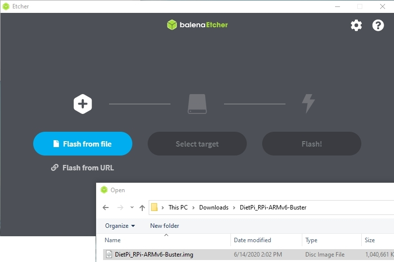
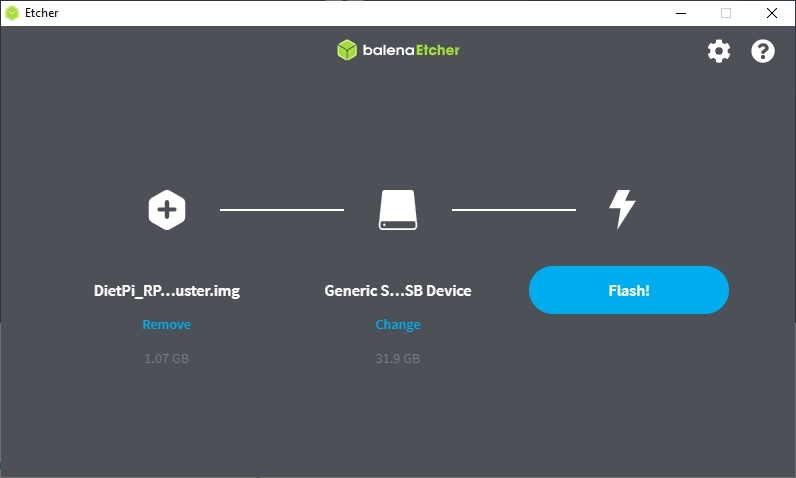

# How to install DietPi

## What do you need ?

To follow this tutorial, you will need the next hardware list:

 - A Raspberry Pi, Odroid or other SBC - open [the list of all supported SBC](../hardware-supported_sbc/)
 - An SD card of at least 4 GiB, and a way to read it on your computer (integrated slot or external SD card reader)
 - Optional: Ethernet (network) cable

_Note_: Following this guide you could make the installation without using a monitor or keyboard connected to your single board computer (known as headless). 

For the software, just two are needed:

 - The latest DietPi image
 - _and_ a software to flash SD card. [Etcher](https://etcher.io/) is available for Windows, Linux and macOS.

## Download and prepare the disk image
Open [dietpi.com](https://dietpi.com#download) and select “Download”. Various supported devices will be displayed. Choose the preferred SBC and click on the **Download**. The disk image will be downloaded locally. 

_Example:_


### Unzip the disk image 

Unzip the dowloaded file to a local folder. 

It is a _7z_ archive format so you will need to install either [7zip for Windows](https://www.7-zip.org/) or [The Unarchiver (Macintosh)](https://wakaba.c3.cx/s/apps/unarchiver.html). Both are free of charge and have been tested to unzip the image correctly.

### Run Etcher and flash the image 

Once you have downloaded and installed [Etcher](https://etcher.io/), start the program. Also, make sure you have your SD card inserted into your computer.
Locate and select the DietPi image.



Next, ensure that the SD card selected is the correct one. It will wipe the drive clean, so if you choose the wrong one, you may risk losing data.


Once you have confirmed all the details are correct, proceed to flash the SD card. This process may take a while.



??? info "Click here if you want to pre-configure WiFi network " 
	To setup Wifi, open the SD card folder, and update next two files using a text editor of your choice:

	1.  Open the file named `dietpi.txt`. Find `AUTO_SETUP_NET_WIFI_ENABLED` and set to value 1.
	2.  Open the file `dietpi-wifi.txt` and set `aWIFI_SSID[0]` to the name of your WiFi network. 
    3.  In the same file `dietpi-wifi.txt`, set `aWIFI_KEY[0]` to the password of your WiFi network.
    4.  Save and close the files

Remove the SD card from the PC and insert it into the Raspberry Pi to prepare to boot for the first time. 

## First boot on DietPi

Insert the SD card into your Raspberry Pi and start it. A few seconds later, you can connect following the instructions on the screen, or connecting via network (through SSH).

- login: **root**
- password: **dietpi**

### Headless install

??? info "Click here if you want to connect via network (running a _headless install_)" 

    **IP Scanning tool**

    For the following steps we require an IP Scanning tool to determine the IP address of the Raspberry Pi. 
    
	- For Windows, you could try `Advanced IP Scanner`. Download the tool from [here](https://download.advanced-ip-scanner.com).
	
	- For Linux, you can use nmap command:

		```
		sudo apt-get install nmap #For installing Nmap
		sudo nmap -sn 192.168.1.0/24 #For scanning IP address
		```

	**Connect to DietPi via SSH**
	
	- A popular SSH Client for Windows is PUTTY. You can download putty from [here](https://www.chiark.greenend.org.uk/~sgtatham/putty/latest.html). Enter in the `Host name` field the IP address found during the scanning, select `SSH` and then click on _Open_ button.
	

	- Most Linux distributions come packaged with an ssh client. Type in your Terminal next command (replace the sample IP address 192.168.1.20 with the one found via scanning the network).
	```
	ssh pi@192.168.1.20
	```

**Initial settings**


## DietPi-Software

DietPi-Software will be automatically displayed on first login. It has lots of useful tools. 
One of the first options to try is to select `Software Optimised` and then tos install.


