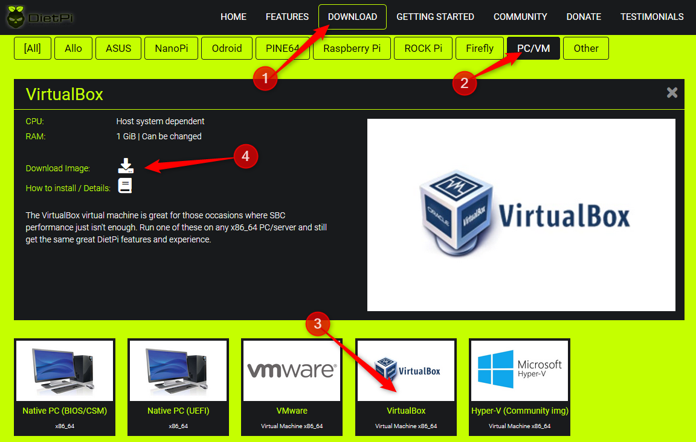

# How to install DietPi as an Oracle VirtualBox machine

## Introduction

Virtual machine images are great for those occasions where you want to set up a DietPi system very quickly and test things. Also it may be used as a debian based linux system with a small footprint for development purposes, e.g. with the X11 window system. The small footprint makes it optimally usable on PCs without a huge built in RAM. Also several VMs may be run for different applications.

One big advantage of such a VM is that id needs only a couple of minutes coming to a running DietPi system.

One of the options of a virtual machine is [__Oracle VirtualBox__](https://www.oracle.com/virtualization/virtualbox/).

### Prerequisites

As a starting point you need a **PC with a running VirtualBox software** on which the DietPi system will run.  
On this PC a free harddisk space of about  
- 1.2 GB for a minimal running system  
- 5-10 GB for a typical running system with X11  
is needed. A recommended size is at least a free space of 10 GB.

## 1. Download and extract the DietPi disk image

Download the **DietPi VirtualBox file** "DietPi_VirtualBox-x86_64-Buster.7z" from [dietpi.com](https://dietpi.com/#download) and
unzip the downloaded file to a local folder. It is a _7z_ archive format so you will need to install either [7zip for Windows](https://www.7-zip.org/) or other alternative tools.

The zip file contains a couple of files, the important one is the .ova file which has to be imported into VirtualBox.

## 2. Import of the .ova file in VirtualBox

As next, the VirtualBox virtual machine has to be setup by importing the .ova file (via \File\Import Appliance):

In the following dialog the user hast to choose DietPi_VirtualBox-x86_64-Buster.ova as the file which shall be imported.

Keep the settings in the next dialog and klick “Import”.

After the importing has finished the DietPi VirtualBox virtual machine is present:

## 3. First boot of the new VirtualBox image
Press the start button (green arrow) to 'boot up' your system based on the DietPi image.
If you do not have a wired LAN connection you have to change the network settings matching to your environment (files ___\boot\dietpi.txt___ and ___\boot\dietpi-wifi.txt___).

Then go on with
	https://dietpi.com/docs/user-guide_install_sbc/#3-first-boot-on-dietpi
and follow the instructions there for the first startup of the virtual machine.
